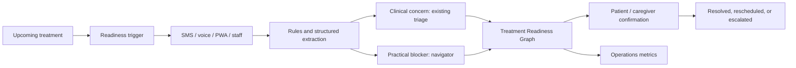

# DevDays 2026 Cancer Care Master Plan

**Challenge partner:** Ochsner Health  
**Research cutoff:** August 22, 2026  
**Final recommendation:** **OncoReady — the Treatment Readiness and Continuity Loop**  
**Decision status:** Proceed with a narrow draft prototype; validate the Ochsner workflow gap before expanding.

---

## 1. Executive decision

### Final problem selection

Cancer treatment can be disrupted when a time-sensitive appointment depends on several concerns—such as transportation, medication access, cost, caregiving, communication, or a symptom report—that enter different channels and do not share one visible resolution plan. The competition strategy is to solve that precise coordination failure, not cancer navigation in general.

### DESIGN DECISION — build this

Build **OncoReady**, a barrier-first, appointment-specific continuity system for people receiving active cancer treatment.

> **One-line pitch:** Before a cancer treatment, OncoReady finds what could derail it, sends each problem to the right human, and confirms the plan—by app, text, voice, or caregiver.

The system anchors every action to one upcoming treatment. A short readiness check identifies transportation, cost, medication-access, caregiving, and communication barriers. If the patient also reports a clinical concern, OncoReady does not diagnose or triage it with AI: it sends the original report through an Ochsner-approved clinical pathway. Practical barriers become time-bound navigator tasks. The patient and authorized caregiver see who owns each task and whether it has been resolved.

The signature feature is a **Treatment Readiness Graph**:

- the upcoming treatment is the root event;
- each unresolved dependency becomes a visible blocker;
- each blocker has one owner, deadline, action, fallback, and closure proof;
- the treatment is never marked “ready” merely because a message was sent;
- a patient/caregiver acknowledgment or staff-confirmed disposition closes the loop.

The product is not a cancer chatbot, a new patient portal, a clinical prediction model, a resource directory, or a replacement for nurse navigation. Its value is converting fragmented patient needs into a single, auditable continuity plan around a time-sensitive treatment.

### Why this is the best competition choice

The solution has the strongest combined fit across the user’s requested criteria:

| Criterion | Why OncoReady is strong |
|---|---|
| Real unmet need | Treatment can fail because several individually manageable barriers collide before an appointment. The exact Ochsner frequency is still unverified. |
| Louisiana relevance | Long travel, rural access constraints, caregiver dependence, and hurricanes make continuity unusually legible locally. |
| Ochsner value | It augments Ochsner’s existing navigation, MyOchsner, urgent help, virtual care, and supportive services instead of rebuilding them. |
| Measurable impact | Ownership time, resolution time, staff touches, fulfilled resources, and treatment kept/rescheduled are measurable in weeks. |
| Defensible novelty | The differentiator is an appointment-linked readiness graph and verified cross-service closure—not a list of generic AI features. |
| Clinical feasibility | Clinical decisions stay in existing clinical pathways; the MVP is administrative and logistical. |
| Technical depth | Temporal rules, dependency graph, workflow state machine, constraint-aware matching, multichannel delivery, audit events, and FHIR mapping. |
| Demoability | One patient message becomes two owned actions and a visibly closed treatment plan in under three minutes. |
| Equity | SMS, voice, staff-assisted use, caregiver delegation, and low-connectivity behavior are core features. |
| Adoption | One infusion cohort and one navigation/triage team form a realistic pilot boundary. |
| Nontechnical appeal | “Catch what could derail tomorrow’s treatment and make sure someone fixes it” is easy to understand and retell. |

### The decisive condition

**HYPOTHESIS:** Ochsner has cases in which clinical concerns and practical barriers arrive through different channels and do not share visible ownership or confirmed resolution around an upcoming treatment.

Ask Ochsner first:

> “When a patient has both a clinical concern and a transportation, financial, medication, or caregiver barrier before tomorrow’s treatment, where are those signals seen together, who owns each action, and how is closure measured?”

If Ochsner already does this reliably in one existing workflow, do not defend a duplicate. Pivot to the narrower **Navigator Closure Graph** described below.

---

## 3. Research method and independent-lead result

Two research leads separately completed the repository skill’s 15 specialist lanes. Lead A emphasized clinical evidence, Louisiana burden, patient journey, Ochsner fit, safety, and feasibility. Lead B emphasized competition behavior, novelty, whitespace, technical differentiation, demo strength, adoption, and judge psychology. They did not inspect each other’s findings until their independent recommendations were complete.

Their reports are available at [Lead A — Clinical & Evidence](./LEAD_A_CLINICAL_EVIDENCE_REPORT.md) and [Lead B — Competition & Innovation](./LEAD_B_COMPETITION_INNOVATION_REPORT.md).

### Convergence

Both leads independently concluded that:

- a generic navigator or chatbot is weak and duplicative;
- Ochsner’s existing teams and channels should be connected, not replaced;
- a narrow closed loop is stronger than an all-journey platform;
- the system must show an owner, action, acknowledgment, and resolution;
- SMS/voice, caregiver participation, synthetic-data honesty, and a working demo are essential;
- AI should assist language and workflow, not make clinical decisions;
- the exact Ochsner handoff gap is a hypothesis that must be validated.

### Disagreement and resolution

| Question | Lead A | Lead B | Master decision |
|---|---|---|---|
| Scope | One pre-treatment symptom-plus-barrier loop | Broader closure across diagnosis, treatment, discharge, and survivorship | Use the narrow pre-treatment trigger. It has clearer ownership, urgency, metrics, and demo flow. |
| Primary value | Clinical and logistical continuity before active treatment | Cross-service ownership and closure | Barrier-first continuity with safe clinical handoff. Do not create another ePRO product. |
| Novelty score | Cautious; 10/15 until Ochsner validation | More optimistic; 13/15 | Treat novelty as conditional and prove the exact mechanism against Epic/Canopy/Thyme Care. |
| Disaster concept | Offline continuity wallet as backup | StormBridge as first backup | Make Storm Mode a stretch demonstration of the same engine, not the primary product. |
| Transportation | Useful but fulfillment-dependent | Strong safe backup | Make fulfilled transport one OncoReady action; keep RideClosed as a pivot only if Ochsner validates it. |

### Cross-examination outcome

After seeing both reports, both leads selected the same reconciled scope: an event-triggered **Treatment Continuity Loop** for one treatment cohort, with minimal barrier questions, safe clinical routing, separate navigator tasks, patient-visible closure, low-bandwidth access, and no autonomous clinical action.

---

## 4. Evidence: what is known and what is not

### VERIFIED FACTS — Louisiana burden and access

- Louisiana recorded an average of approximately **27,260 new invasive cancers per year** in 2018–2022 and about **9,300 cancer deaths per year** in the latest Louisiana Tumor Registry monograph. [Cancer in Louisiana, Volume 40](https://publichealth.lsuhsc.edu/_migrated-binaries/wp-content/uploads/2024/10/1%20Ca%20in%20LA_Vol%2040_Full%20Document.pdf)
- Current federal profiles report higher all-cancer mortality in Louisiana’s rural parishes than urban parishes—**187.5 versus 160.8 per 100,000** for 2019–2023—and a slower rural decline. These are ecological rates, not proof that rural residence itself causes an individual interruption. [NCI rural mortality](https://statecancerprofiles.cancer.gov/deathrates/index.php?age=001&areatype=county&cancer=001&race=00&ruralurban=1&sex=0&statefips=22&type=death), [NCI urban mortality](https://statecancerprofiles.cancer.gov/deathrates/index.php?age=001&areatype=county&cancer=001&output=2&race=00&ruralurban=2&sex=0&sortOrder=desc&sortVariableName=rate&statefips=22&type=death&year=0)
- Louisiana’s state cancer-control plan calls for navigation, referral coordination, abnormal-result follow-up, telehealth/mobile services, survivorship planning, transportation support, and data-targeted interventions. [Louisiana Comprehensive Cancer Control Plan 2022–2027](https://louisianacancer.org/wp-content/uploads/2022/04/LCCCP-2022-2027.pdf)
- Louisiana’s official cancer-care coordination report describes rural constraints involving specialist access, travel, broadband, smaller-clinic IT, pharmacies, and coordination work borne by patients and caregivers. [LDH Improving Cancer Care Coordination](https://ldh.la.gov/assets/docs/LegisReports/SR77_2022RS/SR77_2022RS_LDHReport.pdf)
- Rurality is not a single causal mechanism. Louisiana studies show that socioeconomic conditions, insurance, treatment setting, and regional context explain some apparent rural differences. [Louisiana colorectal study](https://pmc.ncbi.nlm.nih.gov/articles/PMC8904347/), [Louisiana breast study](https://pubmed.ncbi.nlm.nih.gov/32622472/)

**Implication:** use rurality as a deployment constraint and equity measure—not as a simplistic patient risk label.

### VERIFIED FACTS — clinical and operational mechanisms

- In the community-based PRO-TECT trial, systematic electronic symptom reporting with staff alerts delayed the first emergency-department visit and reduced cumulative ED incidence by **6.1%**, but did **not** improve survival; benefit depended on a functioning staff response workflow. [PRO-TECT final results](https://pmc.ncbi.nlm.nih.gov/articles/PMC12184200/)
- A systematic review found navigation generally improved treatment initiation, adherence, satisfaction, and quality indicators, but studies and interventions were heterogeneous. [Cancer navigation review](https://pmc.ncbi.nlm.nih.gov/articles/PMC11063100/)
- A transportation-intervention meta-analysis estimated fewer missed appointments overall, but the evidence was not oncology-specific and had bias limitations. A separate randomized rideshare trial in primary care found no improvement, showing that offering a ride is not the same as assuring access. [Transportation meta-analysis](https://pubmed.ncbi.nlm.nih.gov/35449011/), [rideshare randomized trial](https://jamanetwork.com/journals/jamainternalmedicine/fullarticle/2678828)
- A large observational meta-analysis associated each four-week cancer-treatment delay with higher mortality in many curative indications, but effect size varies by cancer, treatment, and context; it does not prove that this prototype improves survival. [BMJ delay meta-analysis](https://www.bmj.com/content/371/bmj.m4087)
- Cancer care is disrupted by disasters through infrastructure, communication, medicine, and record failures. Evidence for a digital disaster tool’s clinical outcomes is limited. [Lancet Oncology disaster review](https://pubmed.ncbi.nlm.nih.gov/30191852/)

**Implication:** the evidence supports timely detection plus human response and supports measuring continuity. It does not validate OncoReady’s combined workflow or permit a lives-saved claim.

### VERIFIED FACTS — Ochsner current state

Ochsner publicly offers:

- multidisciplinary cancer care and dedicated nurse navigators;
- MyOchsner records, appointments, messaging, virtual care, and caregiver proxy access;
- a 24-hour cancer patient help line;
- social work, financial coordination, nutrition, housing information, and other supportive services;
- virtual cancer visits and survivorship planning;
- **Chemotherapy Care Companion**, a smartphone program that collects blood pressure, weight, and temperature and prompts care-team action when values fall outside expected ranges. Ochsner’s resource page describes it for early-phase research and high-risk chemotherapy patients, while a broader cancer page describes chemotherapy or immunotherapy use; exact current eligibility and workflow require confirmation;
- hurricane guidance, backed-up electronic records accessible across Ochsner locations, and an oncology evacuation guide.

Sources: [Ochsner Cancer Care](https://www.ochsner.org/services/cancer-care/), [Cancer Resources and Support](https://www.ochsner.org/services/cancer-care/cancer-resources/), [Ochsner MD Anderson services](https://www.ochsner.org/services/cancer-care/cancer-services/), [MyOchsner](https://www.ochsner.org/my-ochsner/), [Hurricane Preparedness](https://www.ochsner.org/hurricaneprep/), [Survivorship](https://www.ochsner.org/services/integrative-oncology-services/survivorship/).

**Implication:** do not pitch generic navigation, symptom monitoring, portal communication, telehealth, caregiver record access, survivorship-plan generation, or a hurricane guide as new Ochsner capabilities.

### INFERENCES

- The likely gap is not service existence; it is activation, cross-service ownership, and confirmed closure around a treatment deadline.
- A barrier-first workflow is less duplicative than a new symptom-monitoring system.
- The same readiness graph can handle routine ride/cost/caregiver failures and scale to hurricane disruptions without becoming a disaster-only product.
- Past DevDays winner descriptions suggest that a narrow partner workflow, working end-to-end output, and memorable Louisiana relevance are advantageous. There is no published current judging rubric, so these are not official judging facts.

### HYPOTHESES TO VALIDATE

1. Clinical and practical signals are currently reviewed in separate queues or at different times.
2. Some barriers are documented without one accountable owner and a confirmed resolution state.
3. A treatment-anchored exception queue removes calls, reconciliation, or duplicate outreach rather than adding an inbox.
4. SMS/voice and authorized caregiver participation improve reach for portal-inactive patients without increasing staff burden.
5. Ochsner can maintain resource eligibility/capacity data or connect OncoReady to an approved referral network.
6. One defined infusion or radiation cohort has enough preventable continuity exceptions to justify a pilot.

No Ochsner patient data, baseline, staff interview, integration access, or pilot result has been supplied. None is claimed.

---

## 5. Merged concept pool and selection

### Working rubric

This is a research-derived competition rubric, not an official DevDays rubric.

- unmet need: 15
- Louisiana relevance: 10
- Ochsner value: 12
- measurable impact: 10
- defensible novelty: 13
- clinical feasibility: 10
- technical depth: 8
- demoability: 8
- equity: 7
- adoption potential: 4
- nontechnical appeal: 3
- **total: 100**

| Concept | Need | LA | Ochsner | Measure | Novel | Feasible | Tech | Demo | Equity | Adopt | Appeal | **Total** | Decision |
|---|---:|---:|---:|---:|---:|---:|---:|---:|---:|---:|---:|---:|---|
| **OncoReady Treatment Readiness Loop** | 14 | 9 | 11 | 9 | 11 | 9 | 7 | 8 | 7 | 4 | 3 | **92** | Winner, conditional on gap validation |
| Navigator Closure Graph | 13 | 7 | 12 | 10 | 9 | 10 | 6 | 7 | 5 | 4 | 2 | **85** | Backup 1 |
| Storm Mode / Continuity Wallet | 12 | 10 | 9 | 7 | 11 | 8 | 7 | 8 | 7 | 3 | 3 | **85** | Stretch feature; Backup 2 if emergency owner validates |
| RideClosed transportation fulfillment | 12 | 10 | 10 | 9 | 7 | 9 | 5 | 8 | 7 | 4 | 3 | **84** | Narrow pivot if transport is the confirmed gap |
| Diagnosis Loop Tracker | 14 | 9 | 9 | 10 | 8 | 9 | 6 | 7 | 7 | 3 | 3 | **85** | High-impact alternative; workflow baseline absent |
| Symptom Safety Loop / ePRO | 14 | 7 | 7 | 9 | 4 | 7 | 7 | 8 | 5 | 3 | 3 | **74** | Reject as primary: strong evidence, high duplication |
| Caregiver Relay | 10 | 7 | 8 | 7 | 7 | 8 | 5 | 8 | 6 | 3 | 3 | **72** | Feature, not standalone winner |
| Trial referral closure | 10 | 6 | 8 | 8 | 5 | 7 | 7 | 7 | 4 | 3 | 2 | **67** | Reject: crowded and data-sensitive |
| Oncology admin copilot | 11 | 5 | 10 | 8 | 4 | 8 | 6 | 6 | 3 | 4 | 1 | **66** | Reject: crowded and weak patient story |
| Generic AI cancer navigator | 10 | 6 | 6 | 4 | 2 | 6 | 4 | 7 | 5 | 3 | 3 | **56** | Reject: generic, duplicative, hard to trust |

Scores reflect current evidence, not measured performance. The Diagnosis Loop Tracker ties the backups numerically but is not selected because the public challenge’s prevention/diagnosis boundary is ambiguous and no Ochsner abnormal-result leakage baseline is known.

### Why weak concepts were eliminated

- **Generic navigator/chatbot:** Ochsner already has navigation and MyOchsner; commercial cancer navigators are mature; conversational UI is not a defensible mechanism.
- **Standalone ePRO/RPM:** strong clinical evidence but Ochsner already has Chemotherapy Care Companion and an urgent help line; it adds staffing and regulatory exposure.
- **Simple transportation app:** transport recommendations do not create capacity or ensure attendance; the valuable feature is fulfillment and fallback linked to a treatment.
- **Resource directory:** Findhelp/Unite Us and existing support pages already match or list resources; “displayed” is not “used.”
- **Trial matcher:** NCI provides authoritative trial search and commercial vendors already match patients; eligibility and enrollment are data-intensive.
- **Admin documentation copilot:** crowded, less equitable, and less emotionally connected to the challenge.
- **Disaster-only product:** highly local and memorable but episodic, dependent on emergency governance, and partly overlaps Ochsner preparedness. Fold its best behavior into OncoReady.
- **All-journey platform:** vague ownership, diffuse metrics, and a demo that looks like a dashboard rather than a solved problem.

---

## 6. Winning product specification

### 6.1 Users and jobs

**Primary patient:** a person with an upcoming outpatient cancer treatment who may face symptoms, travel, cost, medication, communication, or caregiver constraints.

**Caregiver:** a patient-authorized helper who can receive specific tasks or confirmations without blanket chart access.

**Navigator:** owns practical barriers and verified resource fulfillment.

**Triage nurse:** owns clinical concerns under existing Ochsner protocols.

**Operations leader:** sees workload, aging tasks, closure, and treatment-continuity metrics.

### 6.2 Core features — build in this order

#### 1. Treatment Anchor

The system begins with one upcoming infusion, radiation session, procedure, or high-risk follow-up. It shows time remaining and the dependencies that must be resolved. This prevents the product from becoming a generic patient task list.

#### 2. Two-minute Readiness Check

Sent once at a pilot-approved interval before treatment, not automatically before every visit. It asks only decision-changing questions:

- Is transportation confirmed?
- Is cost, insurance, or authorization blocking attendance or medication?
- Is the prescribed medication available?
- Is caregiving or dependent care blocking the visit?
- Can the patient receive calls/texts and access the site?
- Is there a clinical concern the existing oncology team should review?

Use SMS first in the demo, with PWA, voice, and staff-assisted paths represented. “Two minutes” is a usability target, not a verified fact.

#### 3. Safe Split Routing

Clinical text is preserved verbatim and routed to the approved clinical pathway. Deterministic demonstration rules can recognize pre-approved red-flag terms, but no model diagnoses, changes treatment, or determines emergency disposition. Practical issues route separately to navigation.

#### 4. Treatment Readiness Graph

The graph displays:

```text
Tomorrow's treatment
├── clinical concern → triage nurse → acknowledged → disposition recorded
├── transportation → navigator → ride confirmed → patient acknowledged
├── medication access → pharmacy/financial owner → resolved
└── caregiver availability → approved proxy/task → resolved
```

Each dependency has a source, timestamp, reason, owner, due time, current state, fallback, and closure evidence.

#### 5. Exception-Only Navigator Queue

Staff see patients needing action, not every check-in. Each card answers within ten seconds:

- Which treatment is at risk?
- Why is this case here?
- Who owns the next action?
- What must happen by when?
- What has already been tried?

#### 6. Fulfillment, Not Matching

The system may suggest pre-vetted transport, financial, lodging, pharmacy, or caregiver actions. A suggestion is not success. States are: eligible/unknown, contacted, accepted, booked, patient confirmed, completed, failed, and human fallback.

#### 7. Patient and Caregiver Status

Patients see “who is helping, what happens next, and when to call.” Caregivers receive only the appointments, tasks, or status categories the patient authorized, with expiration and revocation.

#### 8. Storm Mode — stretch feature

A simulated facility or route disruption identifies affected upcoming treatments and reuses the same readiness graph to create outreach, travel, medication, and rescheduling tasks. It does not autonomously select a clinical site or change treatment timing. The point is to show that routine continuity infrastructure becomes disaster resilience.

### 6.3 Explicit nonfeatures

Do not build for the draft:

- general cancer chat;
- treatment explanations generated from the open web;
- diagnosis, prognosis, or hospitalization prediction;
- autonomous symptom triage;
- medical imaging;
- a statewide resource marketplace;
- real Ochsner login or PHI;
- full billing/reimbursement logic;
- all cancers, all journey stages, or all sites;
- a complex multi-agent architecture.

---

## 7. Novelty and competitive position

### VERIFIED PRIOR ART

- Epic/MyChart Care Companion can provide patient tasks, questionnaires, education, and monitoring.
- Canopy and Carevive provide oncology ePROs and care-team prioritization.
- Thyme Care provides technology-enabled oncology navigation, ePRO/social-needs workflows, and resource support.
- Findhelp and Unite Us support social-needs screening and closed-loop referrals.
- Uber Health supports healthcare transportation coordination.
- Massive Bio and NCI support clinical-trial search or matching.
- Ochsner already offers Care Companion, navigation, patient messaging, supportive services, and hurricane guidance.

Sources: [Epic patient experience](https://www.epic.com/software/patient-experience/), [Canopy](https://www.canopycare.us/), [Carevive](https://www.healthcatalyst.com/products/carevive-by-health-catalyst-oncology-suite), [Thyme Care](https://www.thymecare.com/partners/thyme-box), [Findhelp](https://company.findhelp.com/products/platform/), [Uber Health](https://www.uberhealth.com/), [NCI clinical-trial search](https://www.cancer.gov/research/participate/clinical-trials-search/advanced).

### HYPOTHESIS — defensible delta

> Existing oncology products monitor symptoms, navigate broadly, or close social referrals. OncoReady organizes clinical and practical threats as dependencies of one imminent treatment, separates them into the existing accountable pathways, and does not declare readiness until each required action has verifiable closure.

This delta is a hypothesis until Ochsner confirms it is not already implemented and product demonstrations or procurement diligence confirm competitors do not supply the same configured workflow.

### How to demonstrate novelty rather than assert it

Show a four-column comparison in the pitch:

| Existing layer | What it already does | OncoReady does not replace it | OncoReady adds |
|---|---|---|---|
| MyOchsner | appointments, messaging, records, proxy access | portal and identity | treatment-linked dependency/closure view |
| Care Companion / ePRO | physiologic or symptom monitoring | clinical monitoring | barrier-first readiness plus safe handoff |
| Nurse navigation | human coordination and support | navigator judgment/relationships | exception prioritization and closure evidence |
| Resource/referral network | matching and referral | community directory/capacity | treatment deadline, owner, fallback, patient confirmation |

The novelty slide should never say “no one else does this.” It should say “this is the workflow delta we will validate.”

---

## 8. Technical design

### Architecture



### Buildable stack

- responsive React/Next.js PWA;
- FastAPI or TypeScript API;
- PostgreSQL for demo records, workflow state, resources, and metrics;
- explicit state machine: `detected → assigned → acknowledged → actioned → confirmed → resolved/escalated`;
- deterministic rules for routing and deadlines;
- constraint-aware resource filter using eligibility, hours, geography, language, and known availability;
- optional schema-constrained model for barrier extraction and staff summary;
- append-only event timeline for demo auditability;
- messaging adapter that simulates SMS/voice locally for the draft;
- FHIR adapter using synthetic records.

### FHIR path

Use `Patient`, `RelatedPerson`, `Consent`, `Appointment`, `ServiceRequest`, `CarePlan`, `QuestionnaireResponse`, `Observation`, `Task`, `Communication`, `PractitionerRole`, `Location`, and `Provenance`. mCODE may represent oncology context, but it does not supply the full workflow or patient-reported outcome model. Use Synthea/SMART sandbox data and clearly label the production integration as proposed.

Sources: [FHIR R4](https://hl7.org/fhir/R4/), [mCODE](https://hl7.org/fhir/us/mcode/), [SMART App Launch](https://hl7.org/fhir/smart-app-launch/), [Synthea](https://synthea.mitre.org/downloads).

### Where AI belongs

**DESIGN DECISION:** AI is a supporting feature, not the headline.

Good uses:

- extract nonclinical barriers from a patient’s optional free text;
- quote the evidence span that produced each structured field;
- summarize the case for staff from approved inputs;
- draft plain-language follow-up for human approval;
- later rank nonurgent work inside clinician-defined tiers if local labeled data exist.

Rules remain authoritative for clinical red flags, permissions, ownership, deadlines, resource hard constraints, and task state. If the model fails, the raw message and rules still create the correct workflow.

### Why this has meaningful technical depth

The technical story is not “we called an LLM.” It is:

1. a temporal event model anchored to treatment;
2. a dependency graph that makes hidden blockers explicit;
3. deterministic split routing across clinical and nonclinical owners;
4. a durable state machine that proves closure;
5. constraint-aware fulfillment with fallback;
6. multichannel patient/caregiver delivery;
7. standards-shaped data and measurable workflow telemetry.

---

## 9. MVP and build sequence

### Draft prototype: the smallest version that proves the idea

Build one fully working golden path with clearly synthetic people and no live external dependency.

Required:

- one upcoming infusion;
- one SMS-style readiness check;
- one practical barrier and one patient-reported clinical concern;
- deterministic safe split routing;
- one triage task and one navigator task;
- one pre-vetted transport action;
- one authorized caregiver status update;
- real task-state changes and closure timeline;
- one-click demo reset;
- persistent “synthetic demonstration data” label.

May be simulated and must be labeled:

- Ochsner integration and identities;
- SMS/voice delivery;
- clinical protocol;
- resource availability;
- patient outcome;
- FHIR server connection.

Do not spend draft time on live authentication, a prediction model, maps, a chatbot, billing, or production cloud architecture.

### Finals MVP

Add only features that strengthen the proof:

1. 20–50 synthetic cases and an exception-only staff queue.
2. A FIFO-versus-OncoReady comparison using the same scripted cases.
3. SMS, PWA, phone-assisted, and caregiver views.
4. Unavailable-resource fallback and unacknowledged-task escalation.
5. A low-connectivity scenario.
6. A valid synthetic FHIR bundle/export.
7. A small rules-and-workflow test dashboard.
8. Storm Mode using the same engine.
9. A 90-second offline backup video, local seeded environment, and one-click reset.

### Scope gates

- Freeze the draft after the full loop works.
- Add no feature unless it improves the golden path, answers a likely judge objection, or creates measurable evidence.
- Do not add a live LLM until the deterministic fallback is flawless.
- Do not add a second journey stage until Ochsner validates the first.

---

## 10. Competition demo

### Composite scenario

All people and outcomes are explicitly fictional and synthetic.

**Maria**, 62, lives in rural Louisiana. Her infusion is tomorrow. Her daughter **Ana** lives two hours away and has permission to receive transportation updates.

### Three-minute golden path

1. **The countdown:** show “Infusion tomorrow, 9:00 a.m.” and the readiness check arriving by text.
2. **The human problem:** Maria replies that her ride cancelled and she has a clinical concern.
3. **The split:** OncoReady preserves Maria’s words, routes the clinical concern to the existing triage lane, and creates a separate navigator-owned transportation task.
4. **The feature reveal:** the Treatment Readiness Graph shows two blockers, two owners, response deadlines, and why the appointment is not yet ready.
5. **The action:** a navigator approves a pre-vetted transport option; the simulated nurse records that clinical review occurred under the existing pathway.
6. **The caregiver:** Ana receives only “Transportation confirmed” because that is all Maria authorized.
7. **The payoff:** Maria confirms the plan; the graph changes to “Resolved—plan confirmed.”
8. **The metric:** the screen shows time-to-owner and time-to-resolution for this synthetic scenario.

### The nontechnical retell

> “Maria had two different problems before tomorrow’s cancer treatment. OncoReady got each problem to the right person and made sure the plan was actually confirmed.”

### Failure-path proof

Trigger an optional AI timeout. The raw report and deterministic rules must still create the same tasks. This demonstrates engineering maturity without making safety the centerpiece.

### Demo language to avoid

Do not say OncoReady saved Maria’s life, prevented hospitalization, determined that treatment should proceed, or integrated with Ochsner. Say the synthetic demo shows how the workflow could find, own, and resolve barriers before a treatment decision remains with the clinical team.

---

## 11. Evaluation and proof plan

### Prototype verification

- 100% pass on scripted routing and state-transition tests.
- 100% of required tasks display owner, due time, source, and current status.
- No practical task closes on recommendation alone; closure requires a defined disposition.
- Optional extraction returns valid structured output, quotes its source span, and abstains when uncertain.
- Core demo completes locally without internet or a live model.
- FHIR bundle validates against the selected profiles used in the demo.

### Usability targets — DESIGN TARGETS, not results

- patient completes the minimal readiness check in two minutes or less;
- a navigator identifies treatment, reason, owner, and next action within ten seconds;
- patient correctly states who will respond and what happens next;
- caregiver can accept a task and patient can revoke access;
- core flow succeeds by SMS/voice during a simulated low-connectivity condition;
- an uninvolved listener can retell the patient, problem, mechanism, and result after one demo.

### Assisted pilot proposal — HYPOTHESIS TEST

Pilot one treatment cohort at one Ochsner cancer site for 6–8 weeks with a named triage leader, navigation owner, and approximately 50–100 consenting patients. Begin with two weeks of shadow mode; compare recommendations with staff judgment and take no autonomous action.

Primary measures:

- readiness-check completion by channel;
- signal-to-assignment, acknowledgment, and resolution time;
- percentage of practical blockers resolved before the scheduled treatment;
- unresolved tasks at treatment time and after seven days;
- navigator/triage minutes and touches per resolved case;
- duplicate contacts or documentation;
- fulfilled resource connection rate;
- treatment kept, clinically rescheduled, administratively rescheduled, cancelled, or disposition unknown;
- alerts per 100 patients and unacknowledged alerts;
- completion, response, false-alert burden, and intervention receipt by rurality/travel time, age, race/ethnicity, language, payer, disability, channel, and caregiver availability.

Do not use survival as a pilot endpoint. Hospital/ED use may be exploratory only and should not drive the competition claim.

### ROI hypothesis

Use local operational inputs:

```text
value = navigator/triage minutes avoided
      + duplicated outreach avoided
      + validated unused-slot/rescheduling cost avoided
      − software, integration, messaging, training, and response cost
```

Do not use billed charges, assumed reimbursement, or speculative avoided admissions. CMS oncology models and navigation codes show policy alignment, not guaranteed OncoReady revenue.

---

## 12. Adoption and implementation

### Proposed ownership

- executive sponsor: ambulatory oncology or cancer-service-line operations;
- operational owner: oncology navigation manager;
- clinical owner: oncology triage/nursing leader;
- daily users: navigators, social/financial coordinators, triage nurses, patients, and authorized caregivers;
- enabling partners: MyOchsner/Epic, integration, digital health, quality, and one pilot-site manager.

### Workflow entry

Use one appointment event for one cohort. Do not decide that every treatment needs a 48-hour survey. Ochsner should set the event, timing, questions, owners, and response expectations based on current workflow and capacity.

### Adoption requirements

- work must enter an existing staff surface or replace a current worklist;
- one owner and fallback exist for every task type;
- exceptions are shown, not every normal check-in;
- successful closure removes at least one current call, spreadsheet check, or manual reconciliation;
- resource information has a maintenance owner;
- staff can correct, override, and explain each task;
- the pilot measures burden as rigorously as benefit.

### Scale path

1. One treatment cohort, one site.
2. Additional treatment patterns at the same site.
3. Other Ochsner locations with local ownership and resource configuration.
4. Storm Mode for systemwide disruption exercises.
5. External health systems through the same treatment-event, ownership, FHIR, and metrics contracts.

The reusable product is the readiness/closure engine. Clinical questions, service capacity, ownership, timing, languages, and resources remain locally configurable.

---

## 13. Equity, accessibility, and minimum safe boundary

### Equity is a product behavior

- No required app download, wearable, continuous broadband, or modern smartphone.
- SMS, voice/phone, PWA, staff-assisted, and caregiver paths are co-equal.
- Missing portal data means unknown—not low risk.
- Use travel time, access constraints, and resource availability rather than a crude rural binary.
- Plain language, large controls, keyboard/screen-reader support, strong contrast, captions, and no color-only meaning.
- Human-reviewed translation for clinical instructions.
- Minimal sensitive detail in SMS.
- Resource suggestions must show uncertainty and a human fallback.

### Minimum safe boundary

Security and regulation are not the product story, but the prototype must not undermine trust:

- synthetic/public data only;
- no diagnosis, prescription, treatment modification, or autonomous urgent disposition;
- clinical concern routes to a human-controlled existing pathway;
- named ownership and monitoring-hours/fallback language;
- patient-controlled caregiver access;
- visible source, time, reason, and state;
- AI cannot downgrade a deterministic rule and the workflow survives AI failure.

Do not claim “HIPAA compliant,” “FDA cleared,” “clinically validated,” “bias-free,” “real-time monitoring,” “prevents hospitalization,” “reduces mortality,” or “integrates with Ochsner.”

---

## 14. Risks, kill criteria, and pivot tree

| Risk | Why it matters | Mitigation / test |
|---|---|---|
| Ochsner already has the workflow | Destroys novelty and adoption case | Ask the first mentor question; request a current-state swimlane, not confidential data. |
| Another inbox | Staff will reject it | Show what current task/call/list it replaces; use an exception-only queue or structured export. |
| Symptom-monitoring duplication | Care Companion already exists | Make OncoReady barrier-first; route clinical concerns into the existing program/pathway. |
| Alert fatigue | More detection without capacity can worsen care | Limit cohort/timing/questions; shadow mode; track alerts per 100 patients and acknowledgment. |
| Stale resources | A false ride/resource promise breaks trust | Pre-vetted demo data, explicit availability state, human confirmation, and fallback. |
| Unclear clinical ownership | A surfaced concern without response can be unsafe | Named triage owner, response expectations, and existing after-hours instructions. |
| Weak novelty | “Combination of features” is easy to dismiss | Demonstrate the appointment anchor, dependency graph, split routing, and closure proof. |
| Rural theater | A map or rural persona alone is not equity | Demo SMS/voice and failed-connectivity behavior; stratify pilot metrics. |
| Fake integration | Judges will detect unsupported claims | Label synthetic data and simulated adapters on screen. |
| Overbuilding | Broad scope threatens the working demo | Freeze after one golden path; use a feature gate tied to judge objections. |

### Kill criteria

Pivot if any of these is true:

1. Ochsner already combines the same appointment trigger, barrier intake, clinical handoff, shared ownership, caregiver status, and verified closure.
2. No triage/navigation owner will accept responsibility and response expectations.
3. The product adds an inbox or duplicate entry without removing measurable work.
4. A credible demonstration needs production PHI or live Ochsner APIs.
5. The pilot cohort cannot be identified from a reliable appointment event.
6. Local resource capacity cannot be verified.
7. Staff alert capacity makes the workflow unsafe or infeasible.
8. The team cannot show the full trigger-to-closure path locally.

### Pivot tree

```text
Is the cross-domain pre-treatment gap real?
├── Yes → OncoReady Treatment Readiness Loop
└── No
    ├── Are overdue internal referrals/tasks the gap? → Navigator Closure Graph
    ├── Is transportation fulfillment the dominant gap? → RideClosed
    ├── Is emergency continuity an owned priority? → Storm Mode / Continuity Wallet
    └── None verified → revisit Diagnosis Loop Tracker with organizer scope confirmation
```

---

## 15. Judge objections and likely Q&A

### “Isn’t this MyOchsner plus a questionnaire?”

MyOchsner is a likely channel. OncoReady’s proposed delta is the treatment-linked dependency graph: it separates different blockers into accountable pathways and shows verified closure before the appointment. That delta is still subject to Ochsner validation.

### “Ochsner already has Chemotherapy Care Companion.”

Correct, and OncoReady should not replace it. Care Companion publicly monitors patient-entered vital signs for selected chemotherapy/immunotherapy use. OncoReady is barrier-first and can consume or safely hand off a clinical concern while owning transportation, cost, medication-access, and caregiver dependencies around the treatment.

### “Canopy, Thyme Care, Epic, and Findhelp can do this.”

They cover important components. The proposed distinction is the appointment-specific readiness graph, split ownership, response deadline, and closure proof. We will not claim exclusivity; we will validate whether this exact workflow should be configured, integrated, or built.

### “Why use AI?”

The MVP does not need AI for safety or task state. AI may extract nonclinical barriers from free text and draft a cited summary. The core innovation is orchestration, not a language model.

### “Where does the data come from?”

The prototype uses clearly labeled synthetic FHIR records, a small synthetic resource catalog, NCI questionnaire structure, and public Louisiana context. It has no Ochsner PHI or production integration.

### “Who acts at 2 a.m.?”

OncoReady cannot create staffing. The pilot must use Ochsner’s existing urgent pathway and display its monitoring boundary. Routine barriers wait in the named navigator workflow; urgent concerns follow existing instructions.

### “What if the system is wrong?”

It does not decide treatment or diagnosis. Deterministic approved routing executes first, staff retain authority, raw patient words remain visible, and the workflow continues if optional AI fails.

### “Does it improve survival or prevent hospitalization?”

That is not the claim. Published work supports the importance of monitoring and timely care, but the prototype demonstrates ownership and closure. A pilot would measure workflow and treatment-continuity proxies.

### “How is this more than a dashboard?”

Every state change is functional: intake creates a task, an owner acknowledges it, an action is recorded, the patient/caregiver confirms, and unresolved work escalates. The dashboard displays an operating workflow, not static analytics.

### “Why Louisiana?”

The workflow is designed for long travel, uneven connectivity, caregiver dependence, and hurricane disruption. Those factors appear in the interaction and system behavior—not only in a map or pitch slide.

### “What will Ochsner gain?”

The hypothesis is faster ownership and resolution, fewer duplicated touches, visible exceptions, and more reliable activation of services Ochsner already funds. Those values must be measured locally.

### “What is the business model?”

Begin as a health-system workflow product licensed by site or service line, with implementation and messaging costs. Do not base the pitch on unverified reimbursement. First prove operational capacity and avoided work.

### “What will you build by the deadline?”

One working synthetic golden path: readiness check, safe split, two owned tasks, transport action, caregiver update, and closure timeline—running locally with a reset button.

### “What is your biggest unknown?”

Whether Ochsner already closes this exact cross-domain, appointment-specific loop. The first mentor session is a go/no-go workflow validation, not a sales pitch.

---

## 16. Mentor validation script

Ask for workflow facts, not patient data:

1. Which active-treatment patients receive pre-visit or between-visit check-ins today?
2. What does Chemotherapy Care Companion collect, who is eligible, and where do its alerts go?
3. Where do transportation, cost, pharmacy, caregiving, and clinical concerns enter today?
4. Can staff see those concerns together for the next scheduled treatment?
5. Who owns each issue, and how is acknowledgment and closure recorded?
6. Which issues create the most repeat calls, chart review, rescheduling, or missed treatment?
7. What current screen, worklist, or process would OncoReady have to replace or augment?
8. Which cohort/site has a clear owner, manageable volume, and baseline metric?
9. What resource-capacity data can be trusted and maintained?
10. Which alert or workflow would make you reject this immediately?

### Evidence required to keep building

Obtain at least:

- one confirmed failure mode;
- one named operational owner;
- one current workflow step the prototype removes or improves;
- one baseline or measurable proxy;
- confirmation that the core mechanism is not already available in the same form;
- one safe pilot cohort.

Do not represent mentor comments as interviews or Ochsner commitments until they actually occur and are documented with permission.

---

## 17. Pitch structure

### Three-minute pitch

1. **0:00–0:20 — human stakes:** “Cancer treatment can be derailed by a problem that never reaches the right person in time.”
2. **0:20–0:45 — Maria:** rural patient, infusion tomorrow, clinical concern, lost ride.
3. **0:45–1:35 — working demo:** readiness check → safe split → graph → action → caregiver confirmation → closure.
4. **1:35–1:55 — novelty:** treatment anchor, cross-domain ownership, fulfillment, low-bandwidth closure.
5. **1:55–2:15 — Ochsner fit:** connect existing services; do not replace MyOchsner, Care Companion, or navigators.
6. **2:15–2:35 — evidence and measurement:** ePRO/human-response evidence; workflow metrics; no outcome overclaim.
7. **2:35–2:50 — technical depth:** state machine, rules, FHIR, optional constrained AI, offline reliability.
8. **2:50–3:00 — ask:** validate one workflow and pilot one cohort.

### Slide order

1. Tomorrow’s treatment is at risk.
2. Where today’s workflow can fragment — labeled hypothesis.
3. OncoReady in one sentence.
4. Live golden path.
5. Existing Ochsner capability versus OncoReady delta.
6. Evidence and metrics.
7. Architecture and MVP.
8. Pilot, validation ask, and scale.

### Closing line

> “Ochsner already has the people and services cancer patients need. OncoReady helps make sure the right service reaches the patient before tomorrow’s treatment is lost.”

---

## 18. Final decision record

### VERIFIED FACTS

Louisiana has substantial cancer burden and rural inequity; treatment monitoring, navigation, and timely care have evidence; Ochsner already has extensive oncology, navigation, digital, supportive, caregiver, and preparedness capabilities; and the competition expects a functional live demonstration.

### INFERENCES

The strongest competition opportunity is a narrow connection and closure mechanism across those existing capabilities. An appointment anchor makes the problem measurable, the owners legible, and the demo memorable. Storm resilience strengthens Louisiana relevance when treated as a mode of the same engine.

### HYPOTHESES

Ochsner has a meaningful cross-domain pre-treatment closure gap; the workflow can reduce staff reconciliation; low-bandwidth/caregiver modes improve reach; and resource capacity can be maintained. These must be tested.

### DESIGN DECISIONS

Build OncoReady as a barrier-first Treatment Readiness Loop for one treatment cohort. Use rules and a workflow graph as the technical core; use AI only as an optional assistant. Demonstrate real state transitions with synthetic data. Measure closure and staff work. Keep security as a minimum guardrail, not the product story. Kill or pivot quickly if Ochsner already solves the same workflow.

**Bottom line:** OncoReady is not the most complicated idea in the pool. It is the idea with the clearest patient consequence, strongest Ochsner augmentation story, most convincing technical mechanism, best equity behavior, and most memorable working demo—provided the first mentor conversation validates the gap.

---

## 19. Source references

### Competition

- [Nexus Louisiana DevDays — current challenge](https://www.nexusla.org/programs/devdays)
- [Challenge data page](https://www.nexusla.org/programs/devdays-edtech-data)
- [ASCO overview linked by that page](https://www.asco.org/about-asco/asco-overview)
- [Current linked interest form](https://form.jotform.com/261947954908172)
- [2026 quarterly program announcement](https://www.nexusla.org/articles/nexus-louisiana-announces-2026-program-calendar-expands-to-quarterly-devdays)
- [2026 Digital Wildlife winners](https://www.nexusla.org/articles/nexus-louisiana-and-the-water-institute-announce-winners-of-devdays-digital-wildlife-habitat-challenge)

### Louisiana and access

- [Louisiana Tumor Registry — Cancer in Louisiana, Volume 40](https://publichealth.lsuhsc.edu/_migrated-binaries/wp-content/uploads/2024/10/1%20Ca%20in%20LA_Vol%2040_Full%20Document.pdf)
- [NCI State Cancer Profiles — Louisiana incidence](https://statecancerprofiles.cancer.gov/incidencerates/index.php?areatype=county&cancer=001&race=00&ruralurban=0&sex=0&sortOrder=desc&sortVariableName=cirank&statefips=22&type=incd)
- [NCI State Cancer Profiles — rural mortality](https://statecancerprofiles.cancer.gov/deathrates/index.php?age=001&areatype=county&cancer=001&race=00&ruralurban=1&sex=0&statefips=22&type=death)
- [Louisiana Comprehensive Cancer Control Plan 2022–2027](https://louisianacancer.org/wp-content/uploads/2022/04/LCCCP-2022-2027.pdf)
- [LDH — Improving Cancer Care Coordination](https://ldh.la.gov/assets/docs/LegisReports/SR77_2022RS/SR77_2022RS_LDHReport.pdf)
- [Louisiana rural breast cancer outcomes](https://pubmed.ncbi.nlm.nih.gov/32622472/)
- [Louisiana geographic determinants of colorectal cancer](https://pmc.ncbi.nlm.nih.gov/articles/PMC8904347/)

### Ochsner current state

- [Ochsner Cancer Care](https://www.ochsner.org/services/cancer-care/)
- [Ochsner Cancer Resources and Support](https://www.ochsner.org/services/cancer-care/cancer-resources/)
- [Ochsner MD Anderson Cancer Center services](https://www.ochsner.org/services/cancer-care/cancer-services/)
- [MyOchsner](https://www.ochsner.org/my-ochsner/)
- [Ochsner cancer virtual visits](https://www.ochsner.org/cancer-care-virtual-visits-frequently-asked-questions/)
- [Ochsner survivorship](https://www.ochsner.org/services/integrative-oncology-services/survivorship/)
- [Ochsner hurricane preparedness](https://www.ochsner.org/hurricaneprep/)

### Clinical evidence

- [PRO-TECT final community-oncology results](https://pmc.ncbi.nlm.nih.gov/articles/PMC12184200/)
- [Patient navigation systematic review](https://pmc.ncbi.nlm.nih.gov/articles/PMC11063100/)
- [Transportation intervention meta-analysis](https://pubmed.ncbi.nlm.nih.gov/35449011/)
- [Randomized rideshare trial](https://jamanetwork.com/journals/jamainternalmedicine/fullarticle/2678828)
- [Cancer treatment-delay meta-analysis](https://www.bmj.com/content/371/bmj.m4087)
- [Disaster disruption and cancer care systematic review](https://pubmed.ncbi.nlm.nih.gov/30191852/)
- [NCI PRO-CTCAE](https://healthcaredelivery.cancer.gov/pro-ctcae/overview.html)

### Standards and prototype data

- [HL7 FHIR R4](https://hl7.org/fhir/R4/)
- [HL7 mCODE](https://hl7.org/fhir/us/mcode/)
- [SMART App Launch](https://hl7.org/fhir/smart-app-launch/)
- [Synthea downloads](https://synthea.mitre.org/downloads)
- [WCAG 2.2](https://www.w3.org/TR/WCAG22/)

### Competitive prior art

- [Epic Patient Experience](https://www.epic.com/software/patient-experience/)
- [Canopy](https://www.canopycare.us/)
- [Carevive by Health Catalyst](https://www.healthcatalyst.com/products/carevive-by-health-catalyst-oncology-suite)
- [Thyme Care](https://www.thymecare.com/partners/thyme-box)
- [Findhelp](https://company.findhelp.com/products/platform/)
- [Massive Bio](https://massivebio.com/)
- [FDA clinical-decision-support guidance](https://www.fda.gov/regulatory-information/search-fda-guidance-documents/clinical-decision-support-software)
