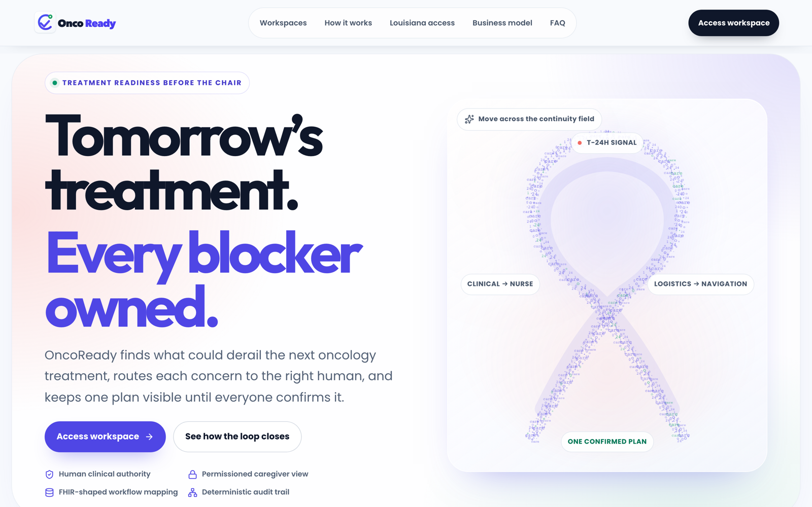

# OncoReady

> 🏆 **Second place, Health Tech, Nexus DevDay 2026**



**The chart describes the treatment. OncoReady shows what could keep the patient from receiving it, and coordinates the response.**

OncoReady is a treatment-readiness and continuity product for cancer care. It combines hospital clinical context (Epic), a readiness model (ReadySignal), patient check-ins, automated outreach and transport coordination (CareLink) so that practical barriers before an infusion, like a cancelled ride or a new symptom, reach the right person in time and end in a plan the patient confirms herself.

- **Live app:** https://oncoready.me (also https://app.oncoready.me)
- **API:** https://api.oncoready.me (FastAPI on Railway with PostgreSQL)
- **Demo script:** [seven-minute product demo](docs/operations/SEVEN_MINUTE_PRODUCT_DEMO.md)

> This README is written so a teammate can build the presentation from it. Each numbered section below maps to one or two slides. The [claims guide](#10-what-we-can-and-cannot-claim) at the end says what is safe to put on a slide.

---

## 1. The problem

Chemotherapy is scheduled weeks ahead, but what stops a patient from getting to the chair usually happens the day before: a ride falls through, a symptom appears, a caregiver isn't available. The hospital record describes the treatment, not these barriers. When they surface late, the infusion is missed or delayed, and nobody owned the problem.

## 2. The story we demo

**Camila Lopez** has her fourth chemotherapy infusion (mFOLFOX6 + Bevacizumab, Cycle 4) tomorrow at 10:00 AM at Benson Cancer Center. Today two things go wrong: **her ride is cancelled, and she isn't feeling well.**

Camila writes: *"My ride was cancelled, and I'm not feeling well today."* OncoReady turns that one message into:

1. **Two owned tasks**, not one generic alert:
   - **Sarah Jenkins, RN** (triage nurse) owns the symptom and records a human decision.
   - **Marcus Vance, MSW** (care navigator) owns the ride.
2. **A recovered ride** through CareLink, even after the first vendor's van breaks down.
3. **A plan Camila confirms herself**, which her caregiver (daughter **Ana**) can also see, limited to logistics only.

The graph moves from **Treatment at risk** to **Continuity plan confirmed**. We deliberately don't claim she made it to the chair; we made sure nothing stood in her way.

## 3. The solution in one picture

```
 Epic record (read-only)   ReadySignal model     Patient check-in / outreach
          \                      |                        /
           \                     v                       /
            +----------->  Treatment Readiness Graph  <-+
                                 |
                 +---------------+----------------+
                 v                                v
        Nurse task (symptom)             Navigator task (ride)
        human disposition                CareLink vendor + backup
                 \                                /
                  +---------> Patient confirms <-+
                              current plan
                                 |
                                 v
                   "Continuity plan confirmed"
```

**Continuity plan confirmed** is reached only when all three exist: the nurse's human disposition, a complete current transport plan (pickup, arrival, return, contact, backup), and the patient's acknowledgment of the current plan version. If the plan changes afterwards, the acknowledgment is invalidated and the blocker reopens.

## 4. Product tour: one app, six workspaces

| Workspace | Who | What they do |
| --- | --- | --- |
| **Landing page** | Visitors, buyers | Product story, how it works, transport partners (CareLink live; Uber Health and Lyft Healthcare **coming soon**), pricing cards (checkout disabled). No patient data on public pages. |
| **Patient Portal** | Camila | Sees her next session and countdown, completes the **Readiness Check**, sees who is resolving each barrier, reviews and **confirms the plan**. A **Report a problem** card lets her flag a new symptom or ride problem later. |
| **Caregiver Portal** | Ana | Sees only the ride logistics she needs (no clinical details) and marks the plan seen. |
| **Care Team** | Sarah Jenkins, RN | **Command Center** of at-risk treatments, **Exceptions** queue, case view with **Epic** clinical data, **Insights** (ReadySignal), **Graph**, **Actions** (accept ownership, record human disposition) and **Outreach** history. |
| **Care Navigator** | Marcus Vance, MSW | Same case, without clinical detail. **Outreach** tab with a real **Call Camila** button. **Transportation** workspace: request a ride, assign a vendor via CareLink, recover when it fails, record pickup, return, contact and backup. |
| **CareLink** (`/carelink`) | Local transport vendor | Separate "CareLink by OncoReady" portal. Vendor sees the trip offer, taps **Accept trip** or **Report unavailable**. The navigator's screen updates immediately. |

Staff sign in through an **Epic-styled sign-in page** and land on the Command Center.

## 5. Key features (one slide each)

### Epic clinical context (real data)
- Camila's demographics, medications, lab observations and appointments come from the **Epic FHIR R4 Sandbox**, captured read-only on September 22, 2026.
- Each capture keeps its source identifiers, retrieval time and a checksum manifest. A **View source details** drawer shows the provenance.
- A roster of additional Epic Sandbox patients with vital signs appears in the patient directory.
- Read-only: nothing is written back to Epic.

#### How Epic access works (OAuth 2.0)

- **Grant:** SMART Backend Services, OAuth 2.0 `client_credentials` with an **RS384-signed JWT client assertion** (no shared client secret). The operator exchanges the signed assertion for a short-lived access token against Epic's Non-Production Sandbox.
- **Token handling:** the capture tool reads the token only from the `EPIC_SANDBOX_ACCESS_TOKEN` environment variable, never from a command argument, and sends it as a `Bearer` header. Error messages never echo the token or response bodies, and captured files are checked to contain no credentials.
- **Endpoint lock:** the capture refuses any base URL other than `https://fhir.epic.com/interconnect-fhir-oauth/api/FHIR/R4`.
- **Read-only by construction:** the HTTP transport permits `GET` only, refuses redirects and caps each response at 5 MB.
- **Minimum necessary data:** `Patient` read, then bounded searches for an allowlist of `Appointment`, `MedicationRequest` and `Observation` (category-scoped to `laboratory` or `vital-signs`), with page and resource ceilings. A capture that hits a ceiling is marked `bounded: true` so a partial chart is never shown as complete.
- **Provenance:** every package gets a manifest with resource types and ids, capture time, source environment, a **SHA-256 checksum per file** and explicit review metadata (who approved it, when). Manifests validate against [`contracts/schemas/epic-capture-manifest.v2.schema.json`](contracts/schemas/epic-capture-manifest.v2.schema.json).
- **Review before use:** captures are staged outside the repository and promoted into `frontend/src/data/` only after review. The app then renders them offline, so the demo never depends on a live Epic connection.
- Code: [`backend/app/epic_capture.py`](backend/app/epic_capture.py), [`backend/scripts/capture_epic_sandbox.py`](backend/scripts/capture_epic_sandbox.py), [`scripts/capture-epic-roster.sh`](scripts/capture-epic-roster.sh).

> **Staff sign-in is not Epic OAuth.** The "Sign in with Epic" page is an Epic-styled preview that accepts only the prepared demo accounts and sends nothing to Epic. Real Epic sign-in (SMART on FHIR user launch) comes with a hospital's Epic onboarding.

### ReadySignal (readiness model)
- Scores readiness risk at **T-7, T-2 and T-1** days before treatment. Camila's signal climbs **13.8 → 20.5 → 26.4**.
- **Why flagged?** shows the factors behind each score.
- **Transportation what-if:** flip one input, "transportation available", and compare. Without transportation her score is **45.2**; with it, **26.4**. That's **18.8 points** from one fix. The comparison never changes the real case.
- Model: logistic regression (`synthetic-logistic-1.0`) on 4 features: transport available, callback requested, unresolved barriers, hours to treatment.
- Trained on **synthetic** data: 1,600 patients / 4,800 rows for training, 400 patients / 1,200 rows held out (split by patient). Held-out accuracy **64.2%** vs **60.3%** majority baseline.
- The score is a model score, **not** a calibrated clinical probability. Notebook and data are in [`ml/`](ml/README.md).
#### ReadySignal 2.0: BERT-style transformer, self-supervised (in development)

> **Status: in development.** The design is below; the code and results are not in the repository yet. The model running in the app today is the logistic regression above. Replace this note with real held-out metrics once the model is trained.

- **Architecture:** a small BERT-style transformer encoder (the Med-BERT approach for health records). Each patient's history before treatment is a sequence of event tokens: checkpoint (T-7, T-2, T-1), transport status, callback requests, unresolved barriers and time to treatment, with a `[CLS]` token for the patient summary.
- **Self-supervised pretraining:** masked event modeling. About 15% of the event tokens are hidden, and the model learns to predict them from the rest of the sequence. It needs no labels, so it can learn from a hospital's full unlabeled history.
- **Fine-tuning:** a classification head on `[CLS]` predicts the readiness target at each checkpoint. It sees only events up to that checkpoint, so later information can't leak into earlier scores.
- **Evaluation plan:** the same patient-separated split as today (1,600 train, 400 held out). It is compared against the majority baseline, the logistic regression and the same transformer without pretraining. It replaces the current model only if it wins on held-out data.
- **Explainability:** "Why flagged?" stays. Factors will come from attention and token-masking attribution rather than regression weights.
- **Data:** synthetic first, then a pilot hospital's real history.

### Outreach engine and live call
- The **Outreach** tab shows the week's history: a T-7 voice check-in, T-2 and T-1 texts, each tagged with its ReadySignal score and the decision it triggered (symptoms routed to the nurse, ride problems to the navigator).
- **Call Camila** places a **real phone call** from inside the product (Twilio, with an ElevenLabs voice agent). The status updates live: Dialing → Ringing → Connected → Call completed.
- Guardrails: the number called is fixed on the server (never chosen in the browser), one call at a time, a daily call limit, and an on/off switch (`DEMO_CALL_BUTTON`).
- The outreach history (earlier calls and texts) is prepared scenario activity; the button call is the live part.

#### How the automated call works

1. **Click:** the browser sends `POST /api/v1/outreach/demo-call` with no phone number and no message. It has nothing to choose.
2. **Guard checks:** the API takes a PostgreSQL advisory lock (`pg_advisory_xact_lock`) so two devices or API instances can't place calls at the same time. It then confirms the `DEMO_CALL_BUTTON` switch is on, outreach is fully configured, patient consent is recorded (`OUTREACH_CONSENT_CONFIRMED`), no earlier call is still unresolved and today's limit (default 4) isn't reached.
3. **Reserve first:** a call attempt row is written and committed **before** any provider request, so every attempt is on record even if the provider times out.
4. **Dial:** the API asks the **ElevenLabs Conversational AI** agent to place an outbound call over **Twilio** to the fixed recipient stored in server settings (E.164 format). Call recording is turned off. The Twilio call SID and conversation id are saved on the attempt.
5. **Live status:** the Outreach tab polls `GET /api/v1/outreach/demo-call` every 2 seconds. On each poll the API reads the call's status from Twilio's Calls API and maps it: queued, initiated, ringing, in progress, then a final `completed`, `busy`, `no_answer`, `failed` or `canceled`.
6. **Done:** once the call is final, it joins the outreach history and the button is ready for the next authorized call.

The browser never receives the recipient number, provider keys or agent ids. Separate operator endpoints (`/api/v1/operator/outreach/*`) need a bearer operator token (constant-time comparison) and a time-limited, consent-stamped call window. Code: [`backend/app/outreach.py`](backend/app/outreach.py).

### CareLink (transport vendor portal)
- Built for local medical transport vendors who run on phone calls, not software. They need only a browser.
- Vendor accepts or releases a trip; the navigator sees it instantly (two browser tabs stay in sync). The shared scenario state lives in browser storage, and the other tab picks up each change through the `storage` event, so the sync works between tabs in the same browser.
- **Recovery flow:** the primary vendor (Crescent Lantern Medical Rides) reports "Vehicle out of service", the plan is marked failed, and the navigator reassigns the backup (Magnolia Wayfare Transport).
- The route map shows the real street route (1420 St. Charles Ave to Benson Cancer Center, 5.2 mi, about 13 min).
- A provider adapter layer is ready for more sources: **Uber Health** adapter built and awaiting a contract and API credentials; **Lyft Healthcare** coming soon.

### Role privacy and accountability
- Each role sees only what it needs: the navigator never sees Camila's symptom words; the caregiver sees logistics only; the vendor sees only first name, last initial, pickup, destination and times.
- Permissions are enforced in the application logic, not just hidden in the UI (e.g. the vendor cannot run navigator actions).
- Every step is recorded in an audit timeline. The closing **Continuity plan receipt** links each completed item to the event behind it.
- The software never reads symptoms or grants clinical clearance. People do.

## 6. Architecture and tech stack

| Layer | Technology |
| --- | --- |
| Frontend | React 18, TypeScript 5, Vite 6, Tailwind CSS 3, Motion, Leaflet (street map), Lucide icons |
| Backend API | Python FastAPI, SQLAlchemy 2, Alembic migrations, Pydantic settings |
| Database | PostgreSQL (outreach ledger: every call attempt is reserved before the provider request) |
| Telephony | Twilio (calls), ElevenLabs (voice agent) |
| Clinical data | Epic FHIR R4 Sandbox, captured read-only JSON with provenance manifest |
| ML | Python notebook, logistic regression on synthetic data, exported JSON the UI reads |
| Hosting | Railway: `web`, `api` and `Postgres` services; custom domains `oncoready.me`, `app.oncoready.me`, `api.oncoready.me` |
| Testing | Vitest + Testing Library, Playwright end-to-end, pytest |

Details: [system architecture](docs/architecture/SYSTEM.md) · [design system](docs/design/DESIGN_SYSTEM.md) · API contract in [`contracts/`](contracts/).

## 7. Quality

- **122** frontend unit and component tests and **14** Playwright end-to-end tests (the full Camila journey, CareLink sync, outreach call with the provider mocked, role privacy).
- **83** backend tests, plus PostgreSQL integration tests run against an isolated database.
- A test fails the build if any web copy contains an em dash, to keep the product voice consistent.

## 8. Real vs prepared (important for slides)

| Part | Status |
| --- | --- |
| Epic clinical data | **Real** Epic FHIR Sandbox data (test patients), captured read-only |
| Phone call from **Call Camila** | **Real** call to a consenting team member's phone |
| CareLink portal and live sync | **Real** software; vendors, drivers and trips are **fictional** |
| ReadySignal | **Real** model, trained on **synthetic** data |
| Outreach history (earlier calls and texts) | **Prepared** scenario activity |
| Camila, Sarah, Marcus, Ana | **Fictional** personas |
| Uber Health | Adapter **built**, **not connected** (needs contract and credentials) |
| Lyft Healthcare | **Coming soon**, nothing built or connected |
| SMS | Not live. The one real SMS test (Sept 22) was **undelivered** pending carrier registration |

## 9. Roadmap (what comes next)

- Conversation results from the call land in the dashboard as tasks, so patients who never open the app can update their care team by phone or text.
- Live SMS once carrier (A2P) registration is approved.
- Uber Health and Lyft Healthcare connections once agreements and API access exist.
- Production Epic connection and real Epic sign-in through a hospital's Epic onboarding.
- Training and validating ReadySignal on a hospital's real history, moving to a **BERT-style transformer (Med-BERT approach)** pretrained **self-supervised** on patient event sequences (appointments, check-ins, outreach replies), then fine-tuned on attendance outcomes. The current explainable model stays as the baseline it has to beat.
- Enterprise authentication and multi-user workflow persistence.

## 10. What we can and cannot claim

**Safe to say:** real Epic Sandbox data, read-only · a real phone call from inside the product · real vendor portal with live sync · readiness model with explainable factors · role-based privacy enforced in logic · every step linked to an audit event.

**Do not say:** connected to a real hospital or production Epic · real patients or customers · HIPAA compliant · clinically validated or improved outcomes · ReadySignal is a clinical risk probability · Uber Health or Lyft is connected, integrated or a partner · SMS delivered · the patient attended treatment.

Full wording rules and Q&A answers: [demo script, truthful presentation rules](docs/operations/SEVEN_MINUTE_PRODUCT_DEMO.md#truthful-presentation-rules).

---

## For developers

### Run locally

Use an isolated local PostgreSQL database. Live outreach also needs server-side provider settings; never use production credentials for ordinary local testing.

```bash
python3 -m venv backend/.venv
backend/.venv/bin/pip install -e './backend[test]'
DATABASE_URL='postgresql+psycopg://localhost/oncoready_local' \
  backend/.venv/bin/alembic -c backend/alembic/alembic.ini upgrade head
DATABASE_URL='postgresql+psycopg://localhost/oncoready_local' \
OPERATOR_TOKEN='replace-with-a-local-random-token' \
CORS_ORIGINS='http://localhost:5173' \
  backend/.venv/bin/uvicorn app.main:app --app-dir backend --reload --port 8000
```

In another terminal:

```bash
cd frontend
npm ci
VITE_API_ORIGIN=http://localhost:8000 npm run dev
```

Checks from `frontend/`: `npm run build`, `npx vitest run`, `npm run test:e2e`. Backend: `backend/.venv/bin/pytest -c backend/pyproject.toml -m 'not integration' tests/backend`. PostgreSQL integration tests require an isolated `TEST_DATABASE_URL`.

### Repository map

| Path | Contents |
| --- | --- |
| `frontend/` | React app (all workspaces, CareLink portal, tests) |
| `backend/` | FastAPI service, outreach adapter, Alembic migrations |
| `ml/` | Synthetic dataset, notebook, trained model export |
| `contracts/` | OpenAPI contract |
| `docs/PROJECT.md` | Product scope and boundaries |
| `docs/features/` | One spec per feature (e.g. `RIDE-002.md` for CareLink) |
| `docs/operations/` | Demo script and live provider evidence |
| `.ai/tasks/` | Task state and review history |

### Rules

- Never commit `.env` files, provider keys, real phone numbers or real patient data.
- Keep the approved visual system ([DESIGN_SYSTEM](docs/design/DESIGN_SYSTEM.md)).
- No em dashes in web copy or web source.
- Sprint history and open gates: [SPRINT_CLOSEOUT](docs/SPRINT_CLOSEOUT.md). Live provider evidence: [Sept 22](docs/operations/OUTREACH-001-LIVE-EVIDENCE.md), [Sept 23](docs/operations/OUTREACH-001-SEQUENTIAL-CALL-EVIDENCE.md).
